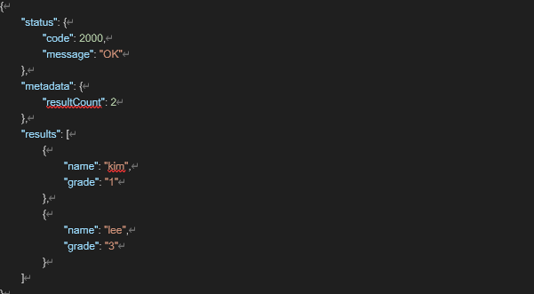
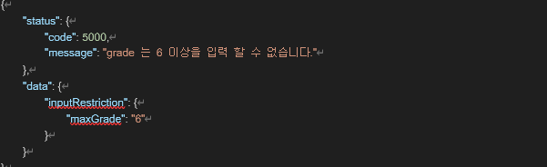
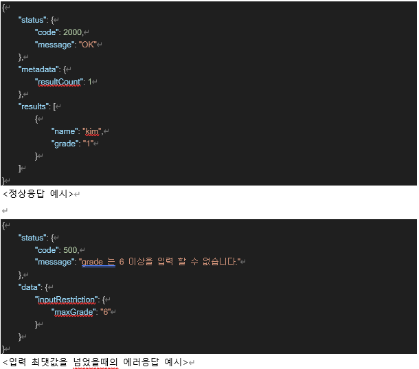
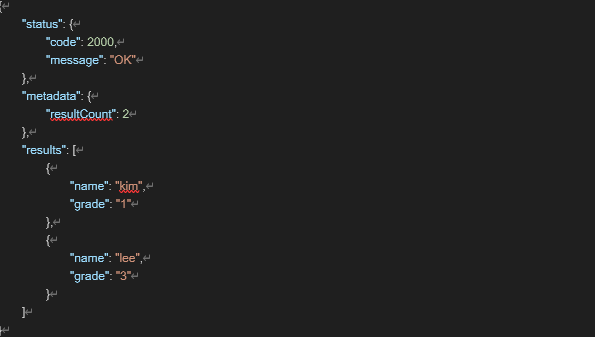
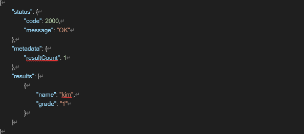
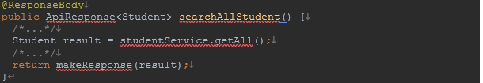
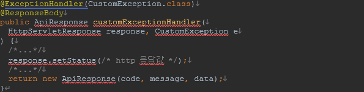
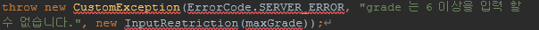
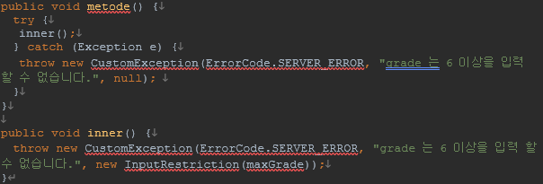

공통 Api 응답모델과 에러 모델을 만들고 간단한 성적 저장/조회하는 api 를 구현 해 봅시다.

응답모델의 예시는 다음과 같습니다.

그리고, 에러 응답은 다음과 같습니다.

* Status.code: http status 가 아닌 서버에서 정의하는 code값이 담겨져 있어야 합니다.(정상응답에서는 항상 200)

* Status.message: 정상응답시에는 “OK”, 에러 응답에서는 에러에대한 상세한 이유를 담아줍니다.

* Metadata.resultCount: 정상 응답시에 나타나는 값입니다. results list 의 count 를 담아줍니다.

* Results: 정상응답시에 나타나는 값입니다. 항상 list 형태로, 실제 응답으로 내주고싶은 정보가 표시됩니다.

* Data: 에러 응답시에 나타나는 값으로, 에러 응답시에 frontend 에서 사용자에게 어떤 이유로 요청이 거부되었는지 메세지를 만들기 쉽게 필요한 데이터를 넣어줍니다.  ****

위의 응답(에러) 예시를 만족하는 응답을 가진 API 를 구현합니다.

(API 요구사항)

1. 이름과 성적을 입력받아 저장하는 api

   a. 성적의 입력은 특정 값(위 에러 응답일 경우에서는 6) 이 넘었을 경우에는 에러 응답이 나타나야 합니다.

2. 입력된 성적을 조회 하는 api

   a. 성적 오름차순으로 조회가 되어야 합니다.

3. 특정 성적을 입력받아, 해당 성적의 학생만 조회하는 api

(구현 요구사항)

1. Controller 에서 응답 모델로 만들어 주어야 합니다.

   a.  ApiResponse<T>: 여러가지 데이터 타입(클래스) 를 result 로 넣을 수 있도록 제네릭을 사용하여서 구현 해야 합니다.

   b. makeResponse(T result), makeResponse(List<T> results): 결과를 응답객체로 만들어주기 위한 메서드입니다. 단건과 복수건 결과 모두 응답 객체로 만들어 줄 수 있도록 두개 모두 구현 해야 합니다.

1. 에러응답을 만들기 위해서는 @ExceptionHander 를 사용하여 exception 의 데이터를 이용해야 합니다.

1. exceptionHander 에서 응답모델을 만들때 필요한 데이터가 포함시킬 수 있는 customException 을 구현 해야 합니다.

   a. ex. CustomException(ErrorCode, massge, data) - ErrorCode 는 enum 으로 정의 합니다.

- ErrorCode 는 enum 으로 정의 합니다.

(수행기간)

* 5일

(결과물)

* 해당 응답/에러 모델을 만든 코드

(하위과제)

* 에러 응답에서 다음의 경우에서도 정상적으로 data 가 응답의 결과로 나올 수 있도록 합니다.

* 구현한 api 이외에 필요하다고 생각하는 api를 추가 구현 하고, 위 api 요구사항에서 문제점이 발견될 경우 개선해보도록 합시다.